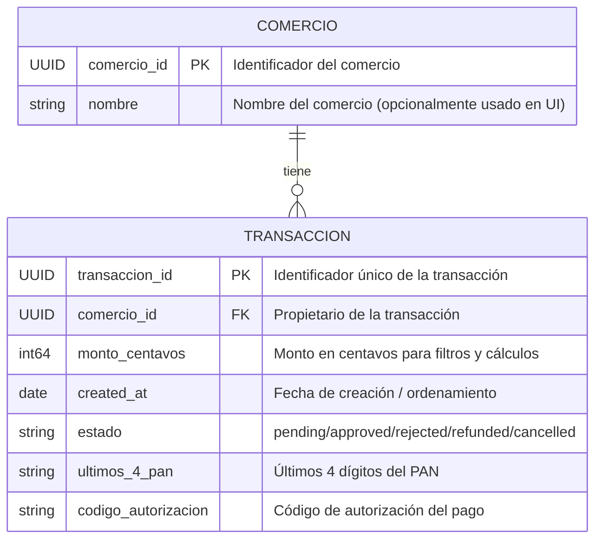

# ERD lógico simplificado · Historial de Transacciones

## Supuestos

- El historial de transacciones se filtra por `comercio_id` tomado del JWT, no por parámetro público.
- `ESTADO` es un campo tipado en `TRANSACCION`, no una tabla independiente.
- Solo se exponen datos necesarios para listar y filtrar transacciones: monto, fecha, estado, últimos 4 dígitos y código de autorización.
- No se incluye PAN completo, CVV ni datos de autenticación sensibles.

## Preguntas abiertas

- ¿Debe `COMERCIO` incluir más atributos de metadatos para la visualización (por ejemplo, `nombre_comercial` o `rut`) o eso queda fuera de este ERD?
- ¿Es necesario exponer un campo de referencia externa o descripción de la transacción en v1 para el cliente, o se mantiene solo el conjunto mínimo de filtros del PRD?
- ¿El cursor de paginación se basa solo en `created_at` + `transaccion_id`, o el diseño debe contemplar un índice de paginación explícito adicional?
