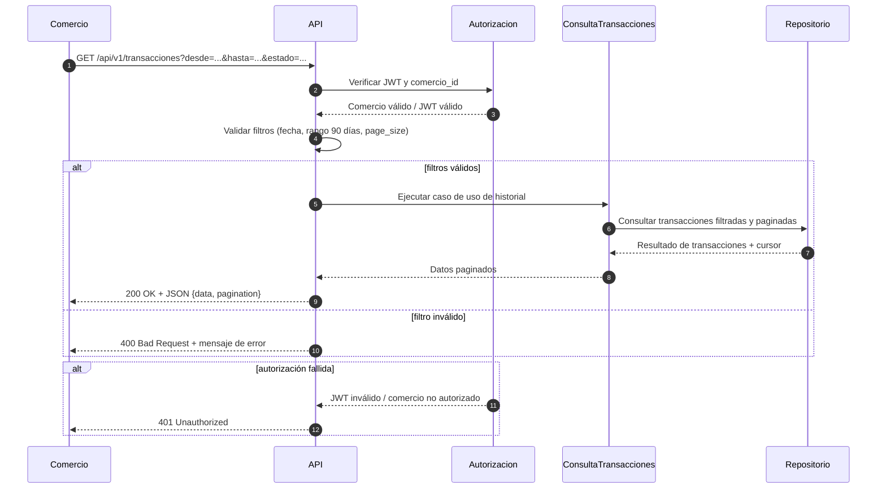

# Diagrama de secuencia · Consultar historial de transacciones

## Notas

- El diagrama evita servicios externos no mencionados en el PRD.
- Se muestra el flujo normal y dos flujos alternativos: filtro inválido y autorización fallida.
